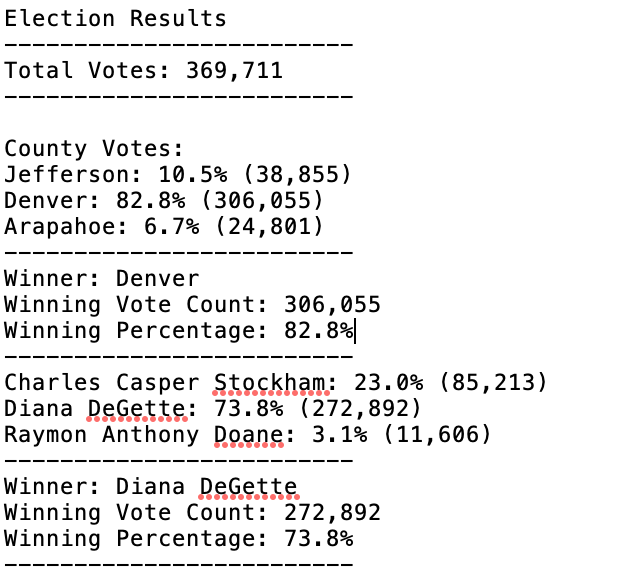

# Election Analysis 

## Overview of Project

In this essay, we would like to help Tom, an election employee, to analyze a large set of election result data and determine the winning candidate for this election. Further more, we want to use this code script as an analysis model so that Tom could use this model to analyze similar dataset for future elections.

Before we started our analysis, we will first give a brief introduction about the dataset we are given. In this raw data sheet, a total of 369711 row of votes was presented. In each row, we are given information for its vote ballot ID, voted candidate name and its county name. There are three county names and three candidiate names are included in this sheet.

## Election-Audit Results
By using our model, we created the following election result graph. According to the below graph, we have some of the key points for this election results. 

- The total number of election votes is 369,711

- There are three counties included in this sheet: Jefferson, Denver and Arapahoe. Jefferson has total of 38,855 votes, counted as 10.5% of the total votes, while Denver has roughly 82.8% of the total votes and the number of votes is 38,855. Arapahoe has 24801 votes and it is 6.7% of the total 

- Denver has the largest number of votes. 

- Three candidates were running for this election: Charles Casper Stockham, Diana Degette and Raymon Anthony Doane. Charles Casper Stockham has received 85213 votes and this number is 23% of the total votes. Diana Degette received 272892 votes and it is 73.8% of the total votes. Raymon Anthony Doane has received 11606 votes and it’s 3.1% of the total vote numbers

- Diana Degette won the election as she received 73.8% of the total votes and received 272892 votes.
